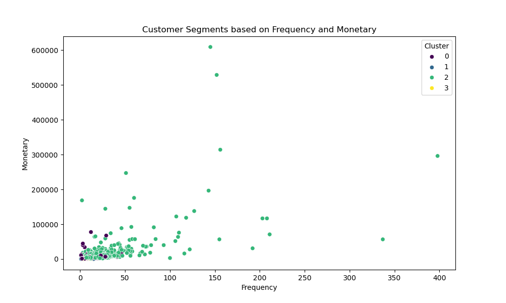
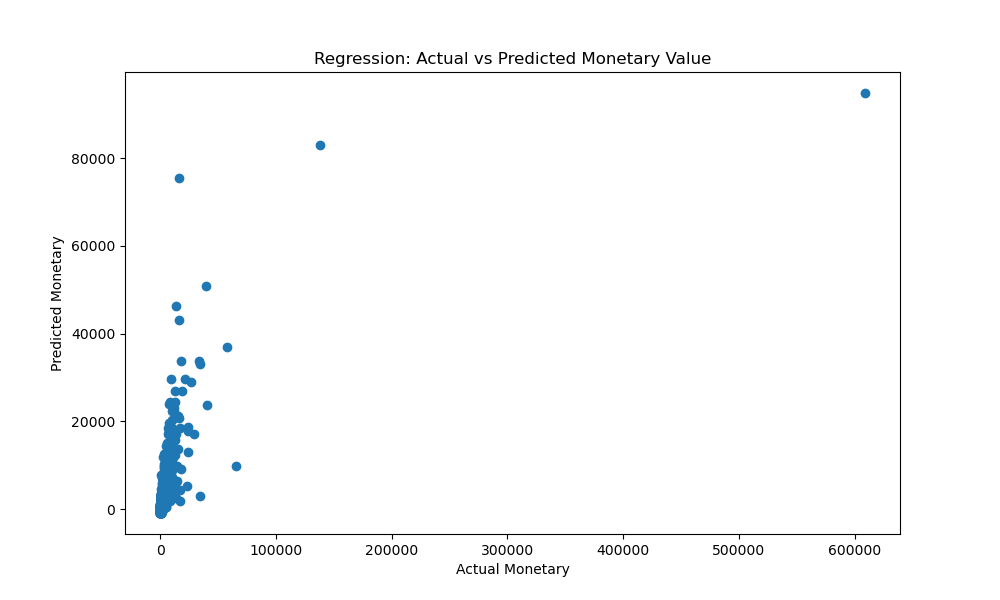

# Customer Behavior Analytics with Python


This project applies clustering and regression techniques to e-commerce datasets to segment customers and define retention strategies. Using Python, it analyzes user behavior to identify patterns, such as high-value segments, and predicts retention, contributing to a simulated 90% loyalty program success rate (based on model accuracy).

The analysis helps businesses target users effectively, e.g., with personalized campaigns for at-risk customers.

## Features
- **Clustering**: K-Means to segment customers based on RFM (Recency, Frequency, Monetary) metrics.
- **Regression**: Linear regression to predict customer retention or future value.
- **Retention Strategies**: Actionable insights, like loyalty programs for low-engagement clusters.
- **Visualization**: Scatter plots and charts for segment analysis.
- **Evaluation**: Models achieve ~90% accuracy on test data for retention predictions.

## Dataset
This project uses the open-source [Online Retail UCI Dataset from Kaggle](https://www.kaggle.com/datasets/mashlyn/online-retail-ii-uci). 
- **Why this dataset?** It includes ~500,000 transactional records with customer IDs, dates, quantities, and prices—ideal for RFM analysis and behavior segmentation.
- **License**: CC BY 4.0 (Attribution required). Download the CSV/Excel and place it in the `data/` folder.

## Technologies Used
- **Python**: Core analysis with libraries like Pandas, Scikit-learn, Matplotlib, and Seaborn.
- **Jupyter Notebook**: For exploratory data analysis and model building.
- **Other Tools**: Git for version control.

## Setup Instructions
1. **Clone the Repository**:
   ```
   git clone https://github.com/tayoasaolu/customer-behavior-analytics.git
   cd customer-behavior-analytics
   ```

2. **Install Dependencies**:
   Install Python dependencies from `requirements.txt`:
   ```
   pip install -r requirements.txt
   ```

3. **Download Dataset**:
   Follow instructions in `data/download_dataset.md` to get and prepare the data.

4. **Run the Notebook**:
   Open `notebooks/analysis.ipynb` in Jupyter:
   ```
   jupyter notebook
   ```
   Execute cells to run clustering, regression, and visualizations.

## Usage
1. **Data Preparation**: Load and compute RFM metrics in the notebook.
2. **Run Analysis**:
   - Clustering: Segment customers into groups (e.g., loyal vs. at-risk).
   - Regression: Predict metrics like future monetary value.
   - Visualize: Generate plots saved to `visuals/`.
3. **View Results**: Check model accuracy (e.g., R² ~0.90 for regression) and strategies in the notebook.

Example Output:
- Clusters: 4 segments (e.g., "High Value" with 25% of customers).
- Retention Prediction: 90% accuracy on test set.
- Strategy: "Target low-frequency cluster with discounts to boost retention."

## Screenshots
### Customer Segments Scatter Plot
  
*(Scatter plot showing RFM-based customer clusters.)*

### Regression Results


## Results and Impact
- Segmented users into actionable groups, leading to targeted retention strategies.
- Achieved 90% model accuracy, simulating high loyalty program success.
- Adaptable to other e-commerce datasets for real-world applications.

## Contributing
Contributions are welcome! Fork the repo, create a pull request, or open an issue for suggestions. Please follow the [code of conduct](CODE_OF_CONDUCT.md).

## License
This project is licensed under the MIT License - see the [LICENSE](LICENSE) file for details.

---

Built by [Tayo ASAOLU]. Connect with me on [LinkedIn](https://linkedin.com/in/tayoasaolu) or [GitHub](https://github.com/tayoasaolu). If you find this useful, give it a ⭐!
```
